# Leaflet for R 示例

<font size=4>

## 判定leaflet for R包是否已经安装，如果没有安装，则进行安装
```
if (!requireNamespace("leaflet", quietly = TRUE))
  install.packages("leaflet")

library(leaflet)
```

## 显示北京
### R语言传统写法（下面不再使用，而用leaflet推荐的管道操作写法）
```
m <- leaflet()
at <- addTiles(m)
addMarkers(at,lng=116.391, lat=39.912, popup="这里是北京")
```


## 管道操作符
```
leaflet()%>%addTiles()%>%addMarkers(lng=116.391, lat=39.912, popup="这里是北京")
```


## 设定地图中心和初始缩放级别
```
leaflet()%>%setView(lng=116.38,lat=39.9,zoom=9)%>%addTiles()
```
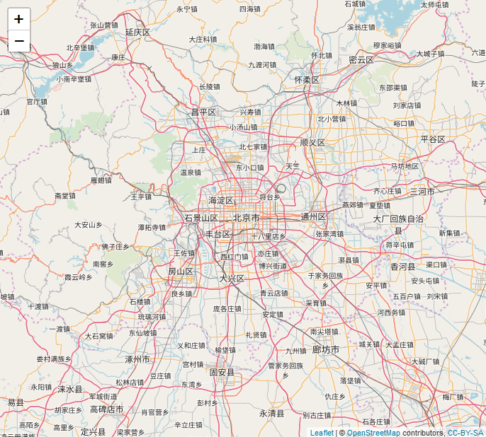


## 绘制100个随机点
```
df = data.frame(Lat = rnorm(100), Lon = rnorm(100))
df %>%leaflet()%>%addCircles()
```
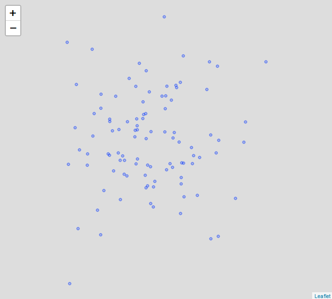

## 用彩虹色带，在亚洲范围内绘制100个环
```
df = data.frame(
  lat = runif(100,min=0,max=70),
  lng = runif(100,min=0,max=160),
  size = runif(100, 5, 10),
  co = substr(rainbow(100),1,7)
)
df%>%leaflet()%>%addTiles()%>%
  addCircleMarkers(lng=~lng,lat=~lat,radius = ~size, color = ~co, fill = TRUE)
```
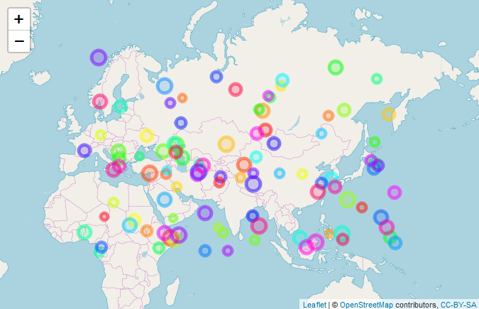

## 利用maps包里面的数据绘制不同颜色的美国各州地图
```
if (!requireNamespace("maps", quietly = TRUE))
  install.packages("maps")
library(maps)
mapStates = map("state", fill = TRUE, plot = FALSE)
leaflet(data = mapStates) %>% addTiles() %>%
  addPolygons(fillColor = topo.colors(10, alpha = NULL), stroke = FALSE)
```
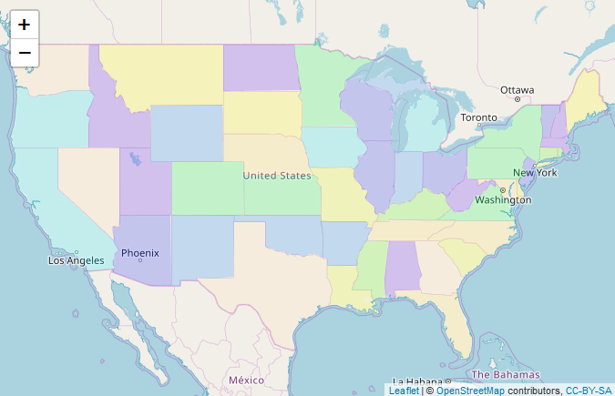

## 绘制Shape file的多边形
```
library(maptools)
library(rgdal)
path <- "D:\\workspace\\DevWork\\example\\GitRDemo\\RDemo\\0004Leaflet for R\\data\\china\\"
poly <- readShapePoly(paste(path,"CNPG_S.shp",sep =""))

poly$FIRST_NAME = iconv(poly$FIRST_NAME,"UTF8","CP936")

leaflet(poly)%>%addTiles()%>%addPolygons(popup=~FIRST_NAME,
                                         fillColor = topo.colors(10, alpha = NULL), 
                                         stroke = FALSE)
```

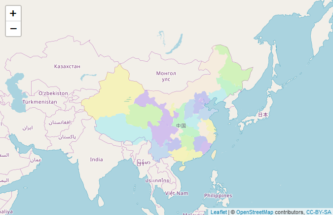

## 绘制中国以“南”结尾的省
```
d =poly[substr(poly$FIRST_NAME,2,2)=="南",]
d%>%leaflet()%>%addTiles()%>%addPolygons(popup=~FIRST_NAME
                                         ,fillColor = topo.colors(5, alpha = NULL), 
                                         stroke = FALSE)
```

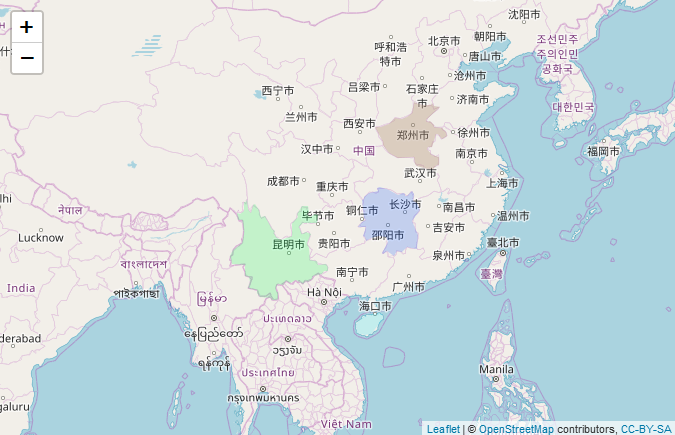

## Stamen的黑白色底图
```
leaflet()%>%setView(lng=116.38,lat=39.9,zoom=3)%>%
  addTiles()%>%addProviderTiles("Stamen.Toner")
```
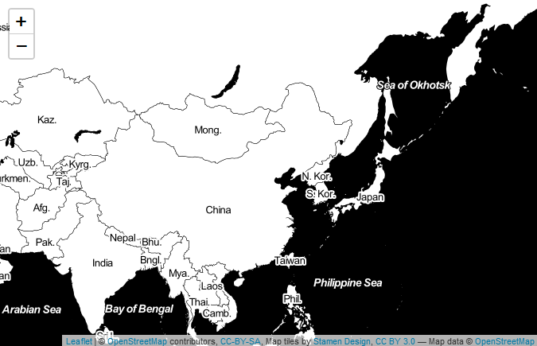

## Esri的影像底图
```
leaflet()%>%setView(lng=116.38,lat=39.9,zoom=3)%>%
  addTiles()%>%addProviderTiles("Esri.WorldImagery")
```
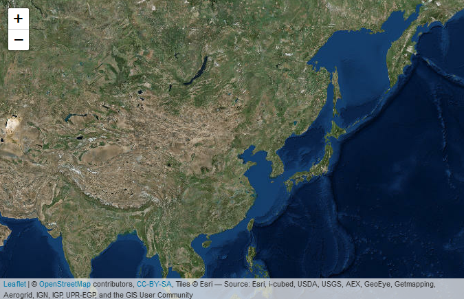

## CartoDB的黑色底图
```
leaflet()%>%setView(lng=116.38,lat=39.9,zoom=3)%>%
  addTiles()%>%addProviderTiles("CartoDB.DarkMatter")
```
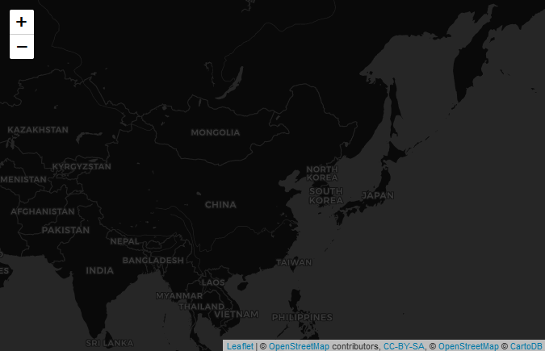

## NASA的2012年全球夜景灯光底图
```
leaflet()%>%setView(lng=116.38,lat=39.9,zoom=2)%>%
  addTiles()%>%addProviderTiles("NASAGIBS.ViirsEarthAtNight2012")
```
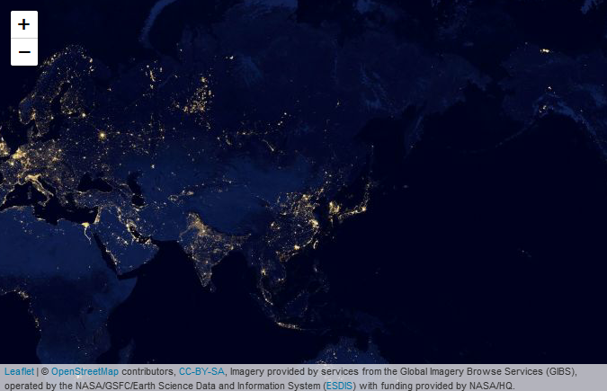

### NASA的2015年Modis卫星影像图
```
leaflet() %>% 
  setView(lng = 110, lat = 30, zoom = 2) %>%
  addTiles() %>% 
  addProviderTiles("NASAGIBS.ModisTerraTrueColorCR",
                   options = providerTileOptions(
                     time = "2015-01-15", opacity = 1))
```


### WMTS图层
```
leaflet() %>% addTiles() %>% setView(-93.65, 42.0285, zoom = 4) %>%
  addWMSTiles(
    "http://mesonet.agron.iastate.edu/cgi-bin/wms/nexrad/n0r.cgi",
    layers = "nexrad-n0r-900913",
    options = WMSTileOptions(format = "image/png", transparent = TRUE),
    attribution = "Weather data © 2012 IEM Nexrad"
  )
```
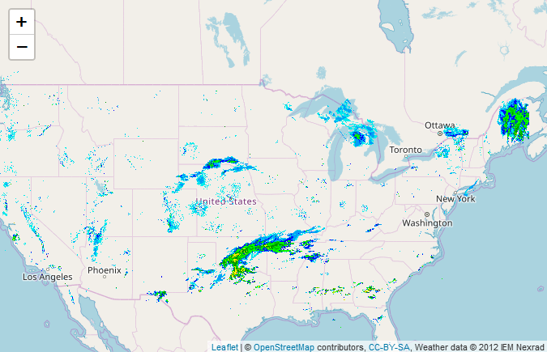

## 随机添加20个标记点
```
df = data.frame(
  latitude = runif(20,min=0,max=70),
  longitude = runif(20,min=0,max=160)
)
df%>%leaflet()%>%addTiles()%>% addMarkers()
```
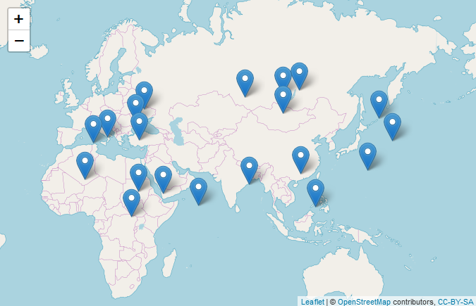

## 添加北京三级及三级甲等医院位置信息
```
bj3H <- read.csv("D:\\workspace\\DevWork\\example\\GitRDemo\\RDemo\\0004Leaflet for R\\data\\bj3H.csv")
leaflet(bj3H)%>%addTiles()%>% addMarkers(popup=~mc)
```
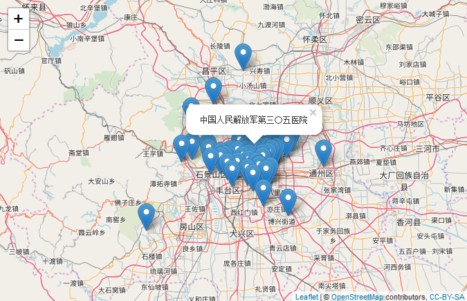

## 自定义位置和显示字段
```
dh <- data.frame(x=bj3H$Longitude,y=bj3H$Latitude,mc=bj3H$mc)
leaflet(dh)%>%
  addTiles()%>%
  setView(116.4,39.9,zoom=10)%>%addMarkers(~x,~y,popup=~mc)

```
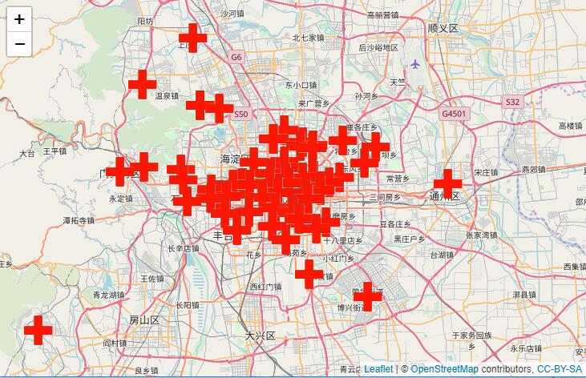

## 自定义图标（需要打开浏览器查看，RStudio某些版本的Viewer窗口看不见图标）
```
redIcon <- makeIcon(
  iconUrl = "http://img.blog.csdn.net/20161015170050664",
  iconWidth = 38, iconHeight = 38,
  iconAnchorX = 19, iconAnchorY = 19
)
leaflet(dh)%>%addTiles()%>%
  addMarkers(~x,~y,popup=~mc,icon = redIcon)
```
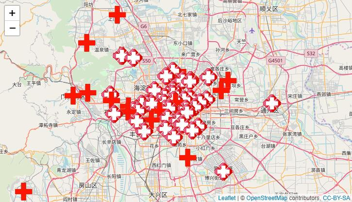

## 加载不同的自定义图标
```
redIcon1 <- makeIcon(
  iconUrl = "http://img.blog.csdn.net/20161015170050664",
  iconWidth = 38, iconHeight = 38,
  iconAnchorX = 19, iconAnchorY = 19
)

redIcon2 <- makeIcon(
  iconUrl = "http://img.blog.csdn.net/20161015173507516",
  iconWidth = 38, iconHeight = 38,
  iconAnchorX = 19, iconAnchorY = 19
)
leaflet()%>%addTiles()%>%
  addMarkers(data=bj3H[bj3H$dj=="三级",],popup=~mc,icon = redIcon1)%>%
  addMarkers(data=bj3H[bj3H$dj=="三级甲等",],popup=~mc,icon = redIcon2)
```


## 用ifelse语法加载不同的自定义图标
```
leafIcons <- icons(
  iconUrl = ifelse(bj3H$dj=="三级",
                   "http://img.blog.csdn.net/20161015170050664",
                   "http://img.blog.csdn.net/20161015173507516"
  ),
  iconWidth = 38, iconHeight = 38,
  iconAnchorX = 19, iconAnchorY = 19
  
)
leaflet(bj3H)%>%addProviderTiles("CartoDB.Positron")%>%
  addMarkers(popup=~mc,icon = leafIcons)
```
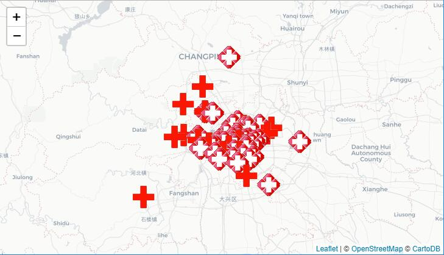

## 多种图标
```
yyIcons <- iconList(
  中国医科院所属医院 = makeIcon("http://img.blog.csdn.net/20161015181859390", iconWidth =32, iconHeight = 32),
  北京区县属医院 = makeIcon("http://img.blog.csdn.net/20161015182217958", iconWidth =32, iconHeight = 32),
  北京市卫生局直属医院= makeIcon("http://img.blog.csdn.net/20161015181915828",iconWidth =32, iconHeight = 32),
  北京中医药大学= makeIcon("http://img.blog.csdn.net/20161015181934175",iconWidth =32, iconHeight = 32),
  卫生部直属医院= makeIcon("http://img.blog.csdn.net/20161015181950879",iconWidth =32, iconHeight = 32),
  中国中医科学院= makeIcon("http://img.blog.csdn.net/20161015182031737",iconWidth =32, iconHeight = 32),
  驻京武警医院= makeIcon("http://img.blog.csdn.net/20161015182043285",iconWidth =32, iconHeight = 32),
  驻京部队医院= makeIcon("http://img.blog.csdn.net/20161015182054598",iconWidth =32, iconHeight = 32),
  部属厂矿高校医院= makeIcon("http://img.blog.csdn.net/20161015182109473",iconWidth =32, iconHeight = 32),
  北京大学附属医院= makeIcon("http://img.blog.csdn.net/20161015182132521",iconWidth =32, iconHeight = 32)
)

leaflet(bj3H) %>%addTiles() %>%
  addMarkers(icon = ~yyIcons[fl],popup=~fl)
```
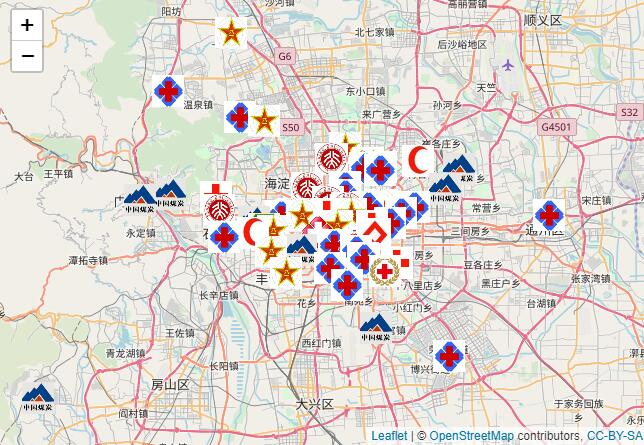

## 随比例尺聚合显示
```
leaflet(bj3H) %>%addProviderTiles("CartoDB.Positron") %>%
  addMarkers(clusterOptions = markerClusterOptions(),icon = ~yyIcons[fl],popup=~fl)
```
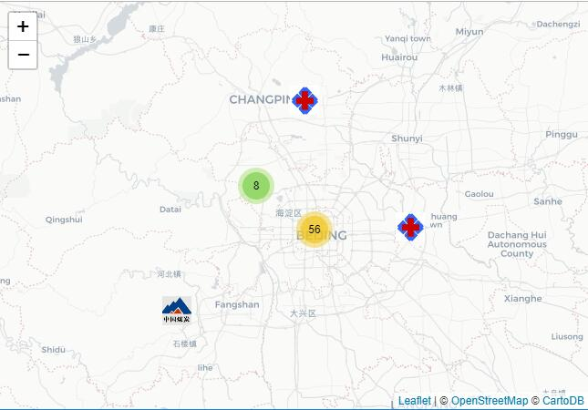

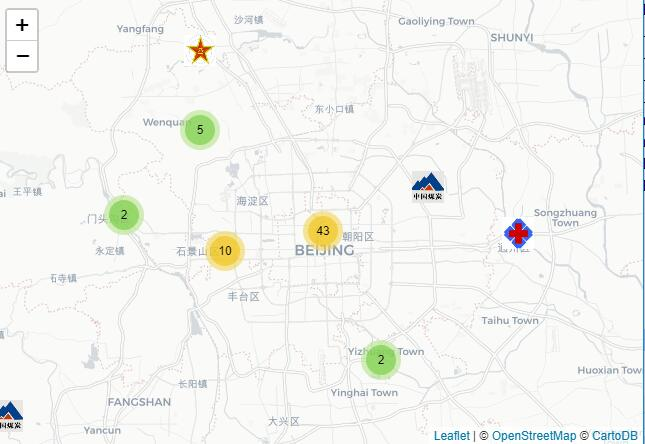

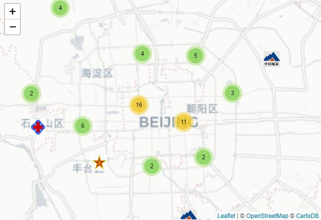

## 绘制圆形
```
leaflet(bj3H) %>%addProviderTiles("CartoDB.Positron")%>%addCircles()
```
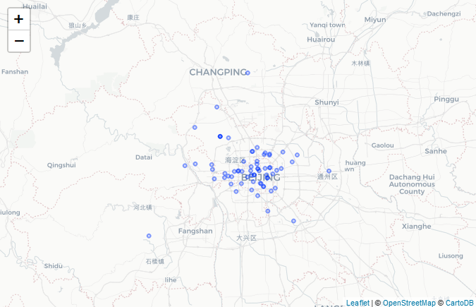

## 散点专题图
```
leaflet(bj3H) %>%addProviderTiles("CartoDB.Positron")%>%addCircles(color="red",weight=bj3H$ks/2)
```
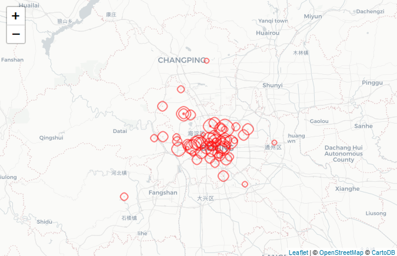

## 镶边的圆形
```
leaflet(bj3H) %>%addProviderTiles("CartoDB.Positron")%>%addCircleMarkers()

leaflet(bj3H) %>%addProviderTiles("CartoDB.Positron")%>%addCircleMarkers(color="red",weight=bj3H$ks/2)
```
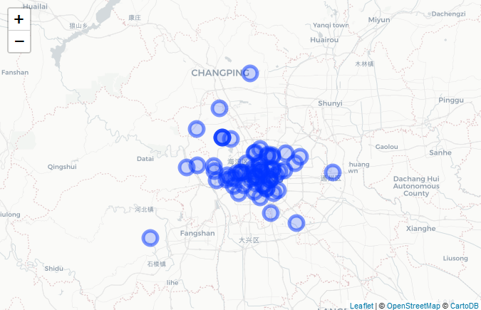

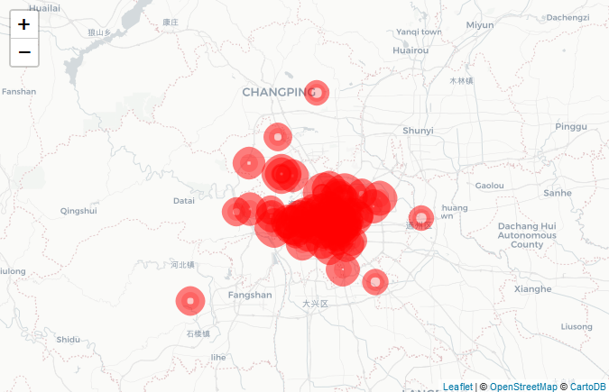

## 分类绘制圆圈
```
leaflet()%>%addTiles()%>%addProviderTiles("CartoDB.Positron")%>%
  addCircles(data=bj3H[bj3H$dj=="三级",],popup=~mc,color="green")%>%
  addCircles(data=bj3H[bj3H$dj=="三级甲等",],popup=~mc,color="red")
```

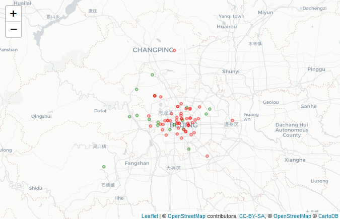

## 分类绘制镶边圆圈
```
leaflet()%>%addTiles()%>%addProviderTiles("CartoDB.Positron")%>%
  addCircleMarkers(data=bj3H[bj3H$dj=="三级",],popup=~mc,color="green")%>%
  addCircleMarkers(data=bj3H[bj3H$dj=="三级甲等",],popup=~mc,color="red")
```

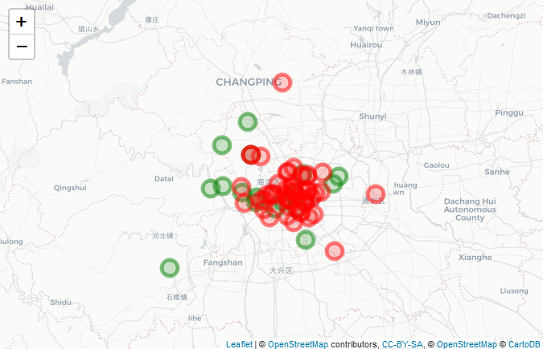

## 预设分类绘制
```
pal <- colorFactor(c("green", "red"), domain = c("三级", "三级甲等"))
leaflet(bj3H) %>% addProviderTiles("CartoDB.Positron") %>%
  addCircleMarkers(color = ~pal(dj),stroke = FALSE,fillOpacity = 0.7)
```
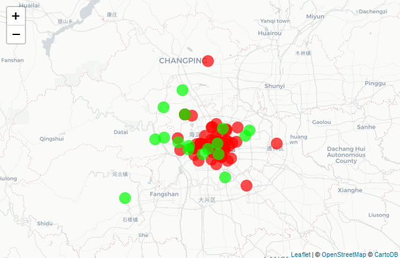

## 颜色分类专题图
```
cPal <- colorNumeric(palette = c("blue","yellow","red"),domain = bj3H$cws)
leaflet(bj3H) %>% addProviderTiles("CartoDB.Positron") %>%
  addCircleMarkers(fillColor = ~cPal(bj3H$cws),
                   stroke = FALSE,fillOpacity = 0.8,popup=~as.character(cws))%>%
  addLegend("bottomright", pal = cPal, 
            values = ~cws,title = "床位数",
            labFormat = labelFormat(suffix = "张"),opacity = 1)
```
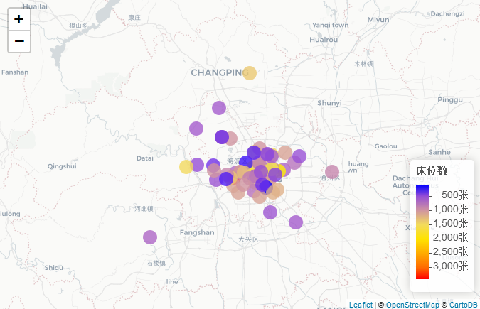

## 弹出窗示例
```
tiananm <- paste("<p>","天安门，坐落在中华人民共和国首都北京市的中心、
                 故宫的南端，与天安门广场以及人民英雄纪念碑、毛主席纪念堂、
                 人民大会堂、中国国家博物馆隔长安街相望，占地面积4800平方米，
                 以杰出的建筑艺术和特殊的政治地位为世人所瞩目。","</p>",
                 "<a href='http://www.tiananmen.org.cn/index.htm'>点击查看更多</a>",
                 "<p></p>",
                 "<p></p>"
)
leaflet()%>%addTiles()%>%addMarkers(lng=116.391, lat=39.906, popup=tiananm)
```
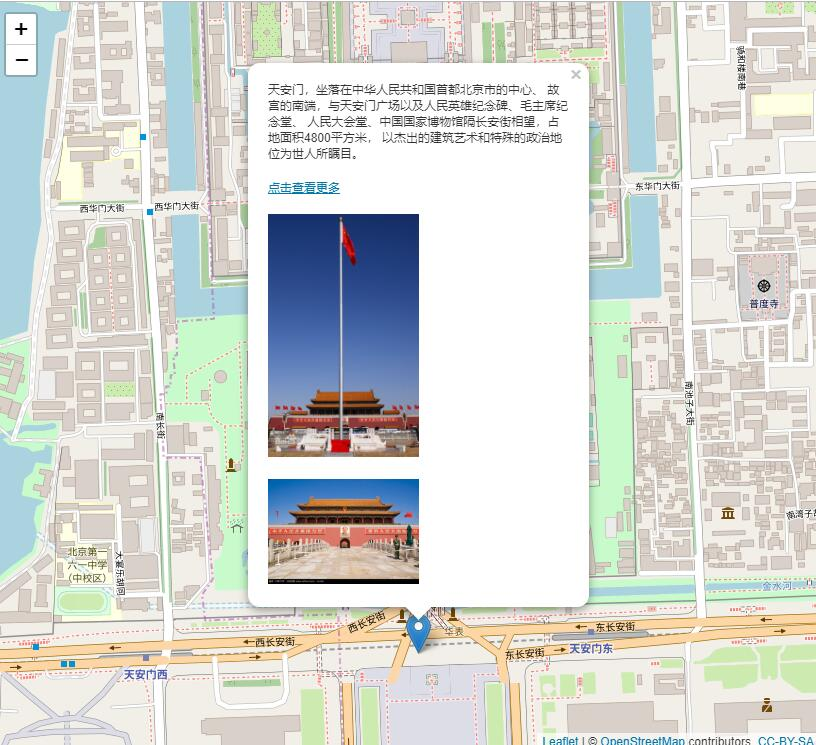

## 定义窗示例信息

```
bj3H <- read.csv("D:\\workspace\\DevWork\\example\\GitRDemo\\RDemo\\0004Leaflet for R\\data\\bj3H.csv")

pop <- paste("名称：",bj3H$mc,"<br/>",
             "等级：",bj3H$dj,"<br/>",
             "分类：",bj3H$fl,"<br/>",
             "科室数目：",bj3H$fl,"<br/>",
             "地址：",bj3H$dizhi1,"<br/>",
             "简介：",bj3H$jj,"<br/>",
             "标记<br/>"
)
leaflet(bj3H)%>%addTiles()%>%addMarkers(popup=pop)
```


## 绘制超级马里奥
```
library(rgdal)
path <- "D:\\workspace\\DevWork\\example\\GitRDemo\\RDemo\\0004Leaflet for R\\data\\"
ma <- readShapePoly(paste(path,"Mario\\ma.shp",sep =""))
pal <- colorFactor(c("#DB231F", "#91462E","#0F0217","#F6C597","#5454D7"), domain = c("A", "B","C","D","E"))
leaflet(ma) %>% addTiles() %>%
  addPolygons(color = ~pal(Co),stroke = FALSE,fillOpacity = 0.9)
```
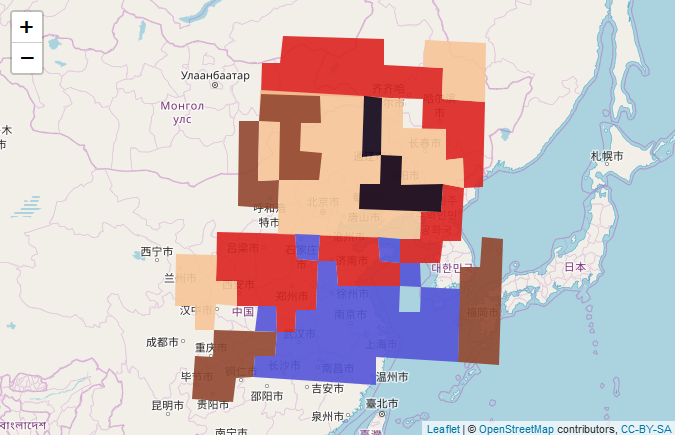

## 绘制北京的高速和主干道
```
bmr <- readShapeLines(paste(path,"bjline\\bjMainRoad.shp",sep =""))
pal <- colorFactor(c("green", "red"), domain = c("0x01", "0x02"))
leaflet(bmr) %>% addTiles() %>%
  addPolylines(color=~pal(bmr$MP_TYPE))
```
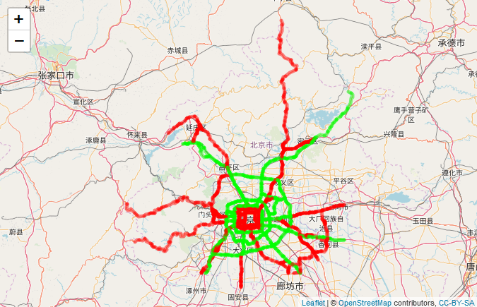


## 绘制矩形
```
leaflet() %>%addTiles() %>%
  addRectangles(
    lng1=116.1, lat1=39.7,
    lng2=116.63, lat2=40.1,
    weight = 3,color = "red",fillColor = "transparent",
    opacity = 1,popup="这里是北京"
  )
```
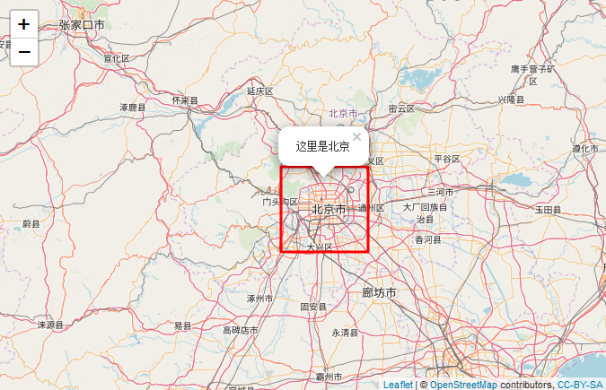

## 用于读取和处理JSON的包
```
library(jsonlite)

path <- "D:\\workspace\\DevWork\\example\\GitRDemo\\RDemo\\0004Leaflet for R\\data\\"
```

## 利用GeoJSON绘制
```
geoData <- readLines(paste(path,"china.json",sep =""),warn=FALSE) %>% 
  paste(collapse = "\n")%>%fromJSON(simplifyVector = FALSE)
geoData$style = list(
  weight = 1,
  color ="red",
  fillColor="green",
  opacity = 1,
  fill = TRUE,
  fillOpacity = 0.6
)
leaflet() %>% setView(lng = 98.583, lat = 39.833, zoom = 3) %>%
  addProviderTiles("Stamen.Toner")%>%addGeoJSON(geoData)
```
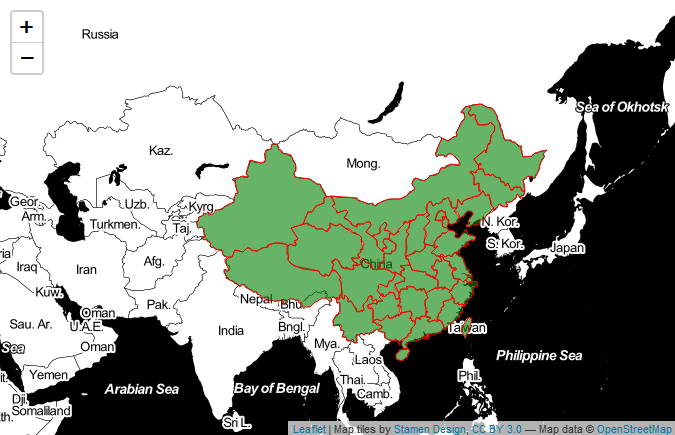

## 唯一值颜色专题图

```
geoData$style = list(
  weight = 1,
  color ="gray",
  opacity = 1,
  fill = TRUE,
  fillOpacity = 0.6
)

pal <- substr(rainbow(34),1,7)
i<-0
geoData$features <- lapply(geoData$features, function(feat) {
  i<<-i+1
  feat$properties$style <- list(
    fillColor = pal[i]
  )
  feat
})
leaflet() %>% setView(lng = 98.583, lat = 39.833, zoom = 3) %>%
  addProviderTiles("Stamen.Toner")%>%addGeoJSON(geoData)
```
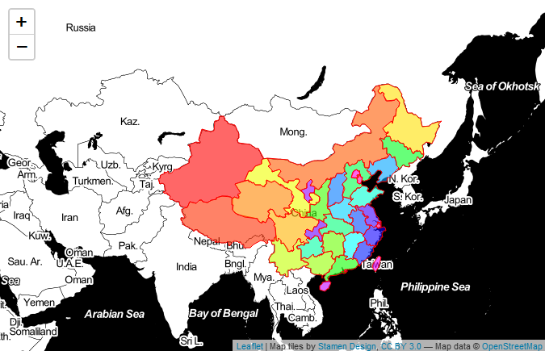

## GeoJSON的数据的GDP色彩专题图
```
geoData2 <- readLines(paste(path,"china_pop_gdp.json",sep =""),warn=FALSE) %>% 
  paste(collapse = "\n")%>%fromJSON(simplifyVector = FALSE)
geoData2$style = list(
  weight = 2,
  color ="gray",
  opacity = 1,
  fill = TRUE,
  fillOpacity = 0.9
)
GDP_2009 <- sapply(geoData2$features, function(feat) {
  feat$properties$GDP_2009
})

pal <- colorNumeric(c("blue", "white", "darkgreen", "yellow", "orangered"), GDP_2009)
geoData2$features <- lapply(geoData2$features, function(feat) {
  feat$properties$style <- list(
    fillColor = pal(feat$properties$GDP_2009)
  )
  feat
})
leaflet() %>% setView(lng = 98.583, lat = 39.833, zoom = 3) %>%
  addProviderTiles("Stamen.Toner")%>%addGeoJSON(geoData2)%>%
  addLegend("bottomright", pal = pal, values = GDP_2009,title = "2009年GDP总量")
```
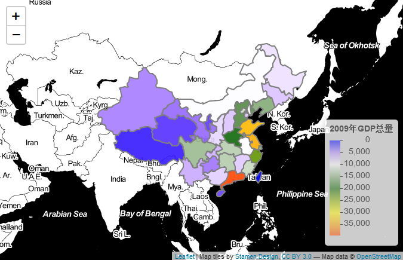

## 人均GDP专题图
```
geoData2 <- readLines(paste(path,"china_pop_gdp.json",sep =""),warn=FALSE) %>% 
  paste(collapse = "\n")%>%fromJSON(simplifyVector = FALSE)
geoData2$style = list(
  weight = 2,
  color ="gray",
  opacity = 1,
  fill = TRUE,
  fillOpacity = 0.9
)
GDP_2009 <- sapply(geoData2$features, function(feat) {
  feat$properties$GDP_2009
})
POP_2009 <- sapply(geoData2$features, function(feat) {
  feat$properties$Pop_2009
})

pal <- colorNumeric("Greens", (GDP_2009*10000)/max(1,POP_2009))
geoData2$features <- lapply(geoData2$features, function(feat) {
  feat$properties$style <- list(
    fillColor = pal((feat$properties$GDP_2009*10000)/max(1,feat$properties$Pop_2009))
  )
  feat
})
leaflet() %>% setView(lng = 98.583, lat = 39.833, zoom = 3) %>%
  addProviderTiles("Stamen.Toner")%>%addGeoJSON(geoData2)%>%
  addLegend("bottomright", pal = pal,value =(GDP_2009*10000)/(max(1,POP_2009)),
            title = "2009年人均GDP（万元）")
```

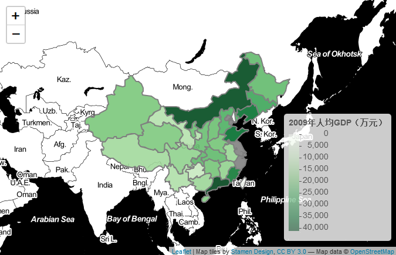

## 栅格数据

## netCDF
```
library(raster)
r <- raster(paste(path,"raster/YSUZ98_KWBN_201312130055-var0-z0-rt0-t0.nc",sep =""))
pal <- colorNumeric(c("transparent",topo.colors(100,alpha = NULL)), values(r),
                    na.color = "transparent")
leaflet() %>% addTiles() %>%
  addRasterImage(r, colors = pal, opacity = 0.8) %>%
  addLegend(pal = pal, values = values(r),
            title = "USA Snow 2013-12-13")
```
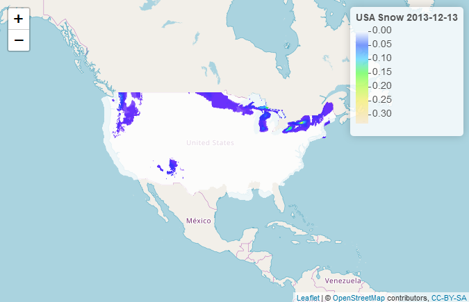

## tif栅格数据
```
r <- raster(paste(path,"raster/flow.tif",sep =""))
pal <- colorNumeric(c("transparent",topo.colors(20,alpha = NULL)), values(r),
                    na.color = "transparent")
leaflet() %>% addTiles() %>%
  addRasterImage(r, colors = pal, opacity = 0.8) %>%
  addLegend(pal = pal, values = values(r),position="bottomleft",
            title = "北京交通主干道车流密度分析")
```
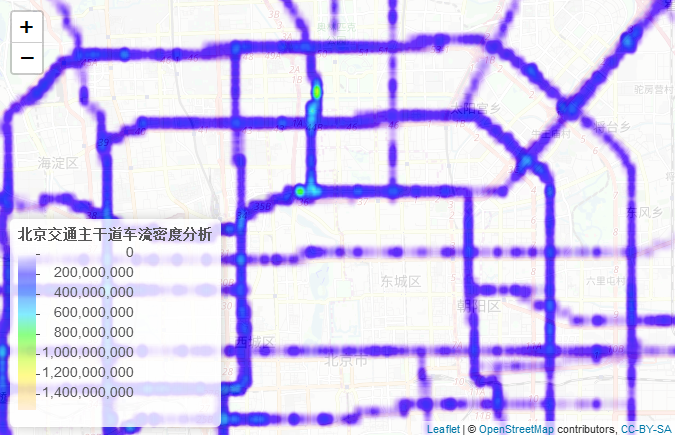

## 人口数量专题图，黄绿红色带配色
```
poly <- readShapePoly(paste(path,"china/CNPG_S.shp",sep =""))
pal <- colorNumeric(c("darkgreen", "yellow", "orangered"),poly@data$Pop_2009)
leaflet(poly) %>% addTiles() %>%
  addPolygons(color=~pal(poly@data$Pop_2009),fillOpacity  = 0.8,weight=1)%>%
  addLegend(pal = pal, values = poly@data$Pop_2009,position="bottomright",
            title = "2009年人口数量（万人）")
```
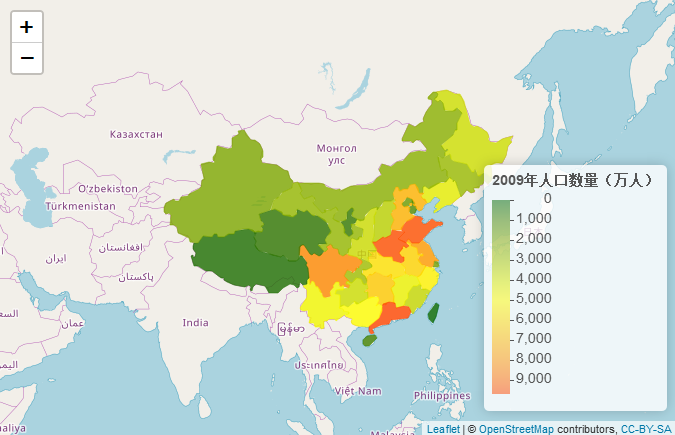

## 人口数量专题图，绿色带配色
```
pal <- colorNumeric("Greens",poly@data$Pop_2009)
leaflet(poly) %>% addTiles() %>%
  addPolygons(color=~pal(poly@data$Pop_2009),fillOpacity  = 0.8,weight=1)%>%
  addLegend(pal = pal, values = poly@data$Pop_2009,position="bottomright",
            title = "2009年人口数量（万人）")
```
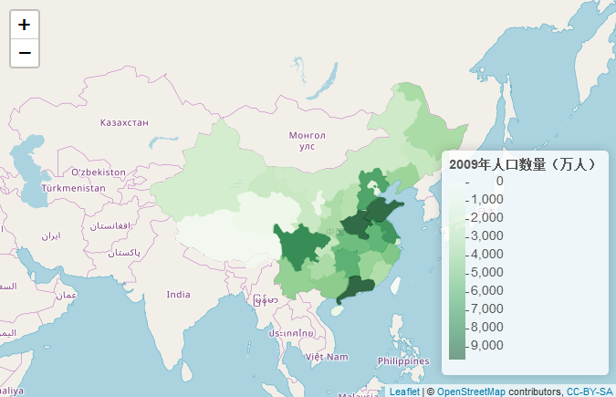

## 人口分级专题图，黄绿红色带配色
```
pal <- colorBin(c("darkgreen", "yellow", "orangered"),poly@data$Pop_2009,10)
leaflet(poly) %>% addTiles() %>%
  addPolygons(color=~pal(poly@data$Pop_2009),fillOpacity  = 0.8,weight=1)%>%
  addLegend(pal = pal, values = poly@data$Pop_2009,position="bottomright",
            title = "2009年人口数量分级")
```
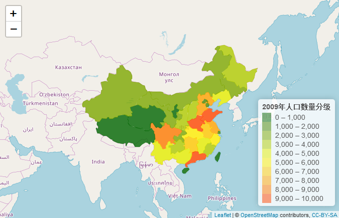

## 人口分级专题图，绿色带配色
```
pal <- colorBin("Greens",poly@data$Pop_2009,10)
leaflet(poly) %>% addTiles() %>%
  addPolygons(color=~pal(poly@data$Pop_2009),fillOpacity  = 0.8,weight=1)%>%
  addLegend(pal = pal, values = poly@data$Pop_2009,position="bottomright",
            title = "2009年人口数量分级")
```

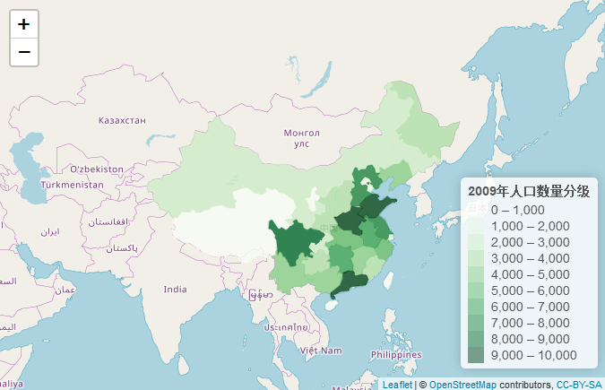

## 图例设置
```
pal <- colorNumeric("Greens",poly@data$Pop_2009)
leaflet(poly) %>% addTiles() %>%
  addPolygons(color=~pal(poly@data$Pop_2009),fillOpacity  = 0.8,weight=1)%>%
  addLegend(pal = pal, values = poly@data$Pop_2009,
            title = "2009年人口数量（万人）</br>默认，右上角")%>%
  addLegend(pal = pal, values = poly@data$Pop_2009,bins=5,position="bottomleft",
            title = "2009年人口数量（万人）</br>图例分级五级，左下角")%>%
  addLegend(pal = pal, values = poly@data$Pop_2009,position="topleft",
            labFormat = labelFormat(suffix = " 万"),
            title = "2009年人口数量（万人）</br>加单位，左上角")%>%
  addLegend(pal = pal, values = poly@data$Pop_2009,position="bottomright",
            opacity = 1,
            title = "2009年人口数量（万人）</br>色带条不透明，右下角")
```
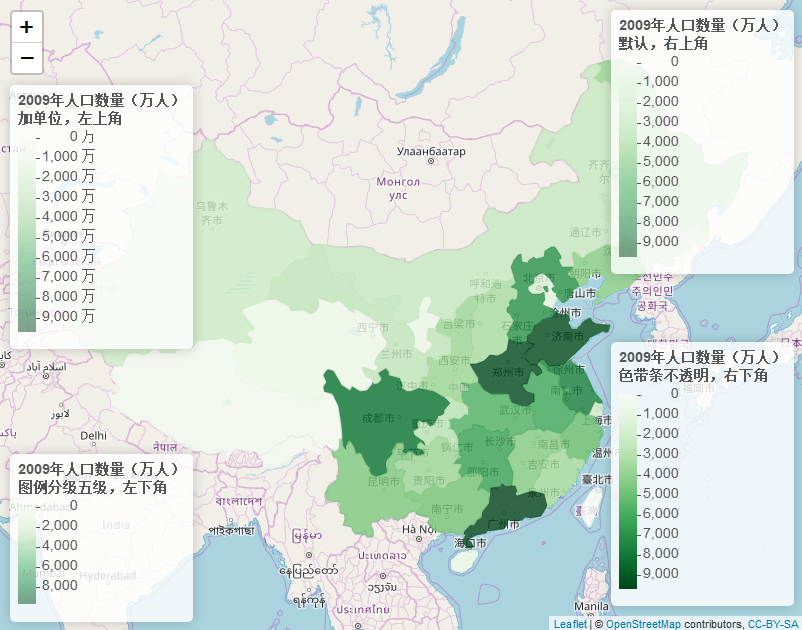

</font>